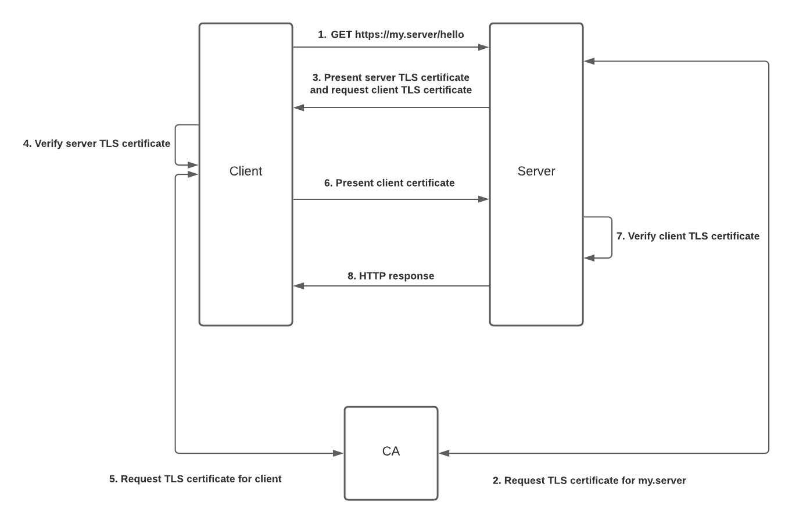

# Mutual TLS Demo
This repository contains a demonstration of mutual TLS between a server and client.

## Architecture
The high level topology of this demonstration looks like this:



Both the client and server communicate with a certificate authority (CA) in order to request TLS certificates to
identify themselves. In this case the [Cloudflare SSL application](https://cfssl.org/) is being used as the certificate
authority.

Both the server and the client are making use of the [Certify](https://github.com/johanbrandhorst/certify) which allows
applications to request and cache TLS certificates as connections are made. The client will make a request to the server,
which triggers the server to request a TLS certificate using the IP/DNS name from the request. If the CA is configure
to allow a certificate for this IP/DNS name, a signed certificate is issued. The server then requests that the client
does the same, once the client passes its certificate to the server, and it is verified there is a secure TCP connection
between the two parties.

Both the server and the client have access to the root certificate for the CA, in order to verify that each others
TLS certificates have been signed by a trusted authority.

## Usage
First you need to generate a root certificate for CFSSL to use, it needs this in order to act as a certificate authority. Do this like so:

```shell
make ca
```

Server, client and CA can be started using [docker-compose](https://docs.docker.com/compose/):

```shell
$ docker-compose up -d
```

You can then monitor the logs of the server and client containers to verify that an HTTP request is made between the two
at regular intervals.